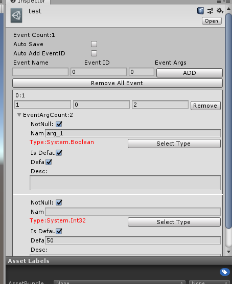
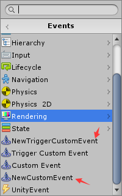
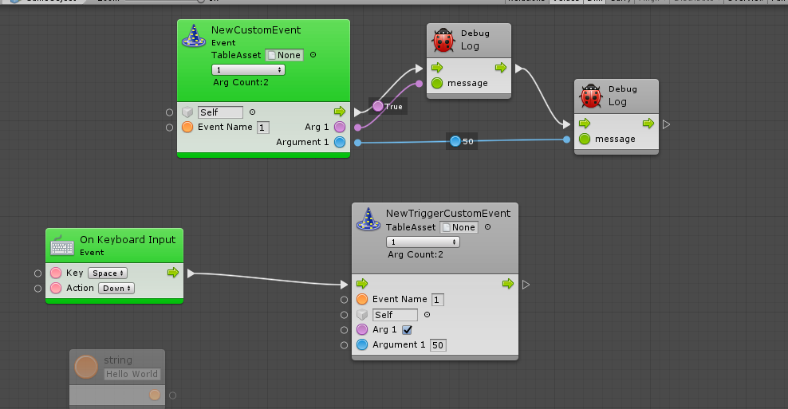

# BoltExtensions

**遇到问题请发起问题哈,谢谢**

### Event Table

**一个强大的事件表系统,从[IUGF](https://github.com/yika-aixi/IGameFrameWork/tree/Bolt)中抽离出来的,不在需要记住xx事件有几个参数,名字是啥,一切让事件表来替你管理**

如何使用:

1. 在`Assets`窗口,右键`Create/Icarus/Event Table`创建事件表

2. 创建一个`Macro`,将`CustomEvent`和`TriggerCustomEvent`替换为`newCustomEvent`和`newTriggerCustomEvent`它们都在一个路径

> 运行结果:

3. 在新的`Unit`中会看到`Table Asset`将创建的好的事件表拖入就可以选择事件啦

4. 结束,祝你使用愉快

**一些Unit**
在`Bolt`路径`Icarus`下